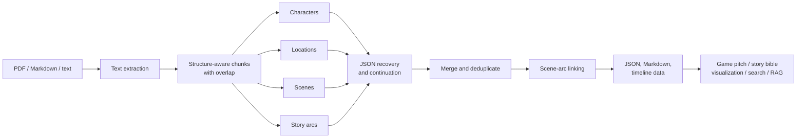

# Narrative Atlas

**Turn book-length narrative source material into a structured story world that writers,
designers, and creative teams can actually reason about.**

Narrative Atlas is an experimental document-intelligence pipeline built to ground a game pitch
in a large source corpus. What began as a way to make thousands of pages usable for creative
development became a deeper engineering exercise: preserve narrative boundaries, extract rich
story artifacts with an LLM, recover from imperfect responses, reconcile repeated entities, and
produce datasets ready for exploration, visualization, or retrieval.

This is not a chatbot and it is not a RAG demo. It is the **corpus-compilation layer that should
exist before either one**.

> Created in December 2025. Extracted from an earlier game-concept repository and rebuilt as a
> standalone, source-agnostic portfolio project.

## Proven on long-form material

The original pipeline was exercised end to end on a private, three-volume narrative corpus:

- **1,838 PDF pages** and **4.2 million extracted characters** processed as one source;
- **43 structural segments** reconstructed from the raw text;
- **153 dramatic scenes** extracted into machine-readable records;
- **154 characters** indexed across the resulting scene timeline;
- JSON and Markdown outputs produced for both programmatic use and human review.

Those numbers describe one validation run, not a universal benchmark. The corpus itself and its
derived content are intentionally absent from this repository.

## From a wall of text to a narrative model



The important design choice is the middle of the diagram. Long-form extraction is not one giant
prompt: it is a sequence of bounded, inspectable transformations with checkpoints between them.

## What makes the pipeline resilient

### Narrative-aware chunking

Headings and chapter markers are treated as first-class boundaries. Oversized sections fall back
to paragraph or sentence boundaries, with configurable overlap to preserve context across cuts.
Every chunk carries source offsets and an estimated token count in the run manifest.

### Defensive structured output

LLM output is treated as untrusted data. The extraction loop strips Markdown fences, repairs
simple container truncation, salvages complete JSON objects from malformed arrays, retries syntax
failures, and requests fresh continuation arrays without accepting duplicate records.

### Cross-chunk reconciliation

Characters, locations, and arcs naturally recur. Narrative Atlas canonicalizes their identities,
keeps the earliest source locator, unions list fields, preserves the highest significance rating,
and chooses or combines descriptions according to completeness. Merge counts remain visible for
auditability.

### Narrative graph construction

Scenes are linked to story arcs using overlapping characters, themes, conflicts, and locations.
The final timeline includes ordered scenes, arc membership, tension values, and a character
presence index suitable for visualization or downstream analysis.

### Checkpointed runs

Each chunk/type result is written atomically before aggregation. Interrupted or rate-limited runs
can resume without paying to process completed chunks again, while `--no-resume` forces a clean
re-extraction when prompts or models change.

## Extracted artifacts

| Artifact | Purpose | Representative fields |
| --- | --- | --- |
| Characters | Build a cast and relationship map | role, motivations, aliases, traits, significance |
| Locations | Build a world bible | type, atmosphere, events, narrative significance |
| Scenes | Recover atomic dramatic units | summary, cast, setting, purpose, tension, themes |
| Story arcs | Track threads across the work | stage, key events, conflicts, themes, span |
| Timeline | Join the model for exploration | ordered scenes, linked arcs, character presence |

The extraction specifications live in
[`src/narrative_atlas/extractors.py`](src/narrative_atlas/extractors.py) and are deliberately easy
to replace or extend with additional schemas.

## Try it

Narrative Atlas requires Python 3.10+ and an Azure OpenAI deployment for semantic extraction.
PDF ingestion and the deterministic processing layers run locally; model calls incur provider
costs.

```bash
git clone https://github.com/duboisg/narrative-atlas.git
cd narrative-atlas
python -m venv .venv

# Windows PowerShell
.venv\Scripts\Activate.ps1

pip install -e ".[dev]"
copy .env.example .env
```

Add your Azure credentials to `.env`, then ingest a document you are authorized to process:

```bash
narrative-atlas ingest path/to/source.pdf --output workspace/source.txt
```

Run the complete compiler:

```bash
narrative-atlas analyze workspace/source.txt --output workspace/atlas
```

Or keep the first experiment small:

```bash
narrative-atlas analyze examples/the-glass-archive.md --output workspace/demo --extract characters locations
```

The output directory contains a run manifest, per-chunk checkpoints, consolidated JSON, readable
Markdown, and — when scenes and arcs are both selected — a linked `timeline.json`.

## Repository map

```text
src/narrative_atlas/
├── chunking.py      # Boundary-aware segmentation and overlap
├── client.py        # Azure adapter, retries, continuation loop
├── extractors.py    # Narrative schemas and prompts
├── graph.py         # Scene-arc links and timeline projection
├── ingest.py        # PDF, Markdown, and text ingestion
├── merge.py         # Cross-chunk entity reconciliation
├── parsing.py       # JSON repair and partial recovery
└── pipeline.py      # Checkpoints, aggregation, and rendering
```

## Status and limitations

Narrative Atlas is a research-grade local pipeline, not a production content platform.

- Extraction quality depends on the model, prompt, source formatting, and the ambiguity of the
  narrative. Human review remains part of the workflow.
- The token estimate is intentionally approximate; it is used for run visibility, not billing.
- Image-only PDFs require OCR before ingestion.
- The current entity merge is lexical. Alias resolution and embedding-assisted clustering are
  natural next steps for noisier corpora.
- Scene-to-arc links are explainable overlap scores, not learned semantic edges.
- Source files, generated outputs, and credentials are ignored by Git by default. Process only
  material you own or are authorized to use.

## Why this matters for creative development

A compelling pitch needs more than a synopsis. It needs a navigable model of the source: which
characters collide, where tension rises, which locations carry dramatic weight, and which arcs
can support missions, systems, or player choices. Narrative Atlas turns close reading at scale
into structured creative leverage — while keeping the intermediate evidence inspectable.

The same foundation can support story bibles, adaptation research, editorial analysis,
visualizations, and future retrieval systems without coupling the corpus compiler to one final
interface.

## License

The code is available under the [MIT License](LICENSE). Input documents and generated artifacts
retain their own rights and are not covered by the software license.
